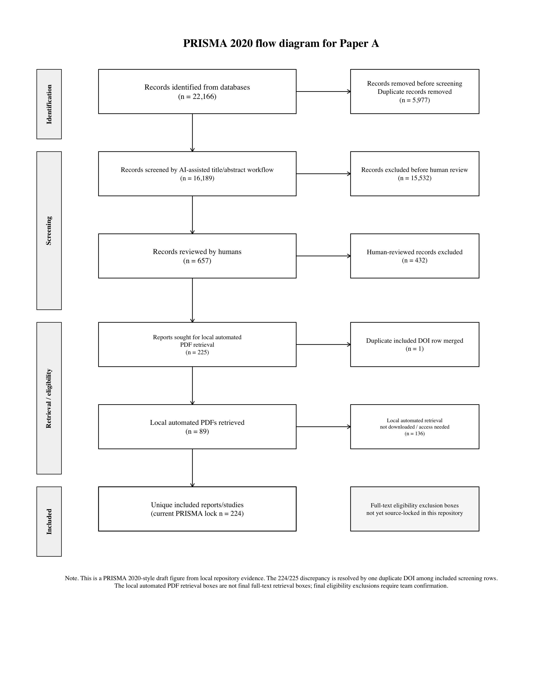
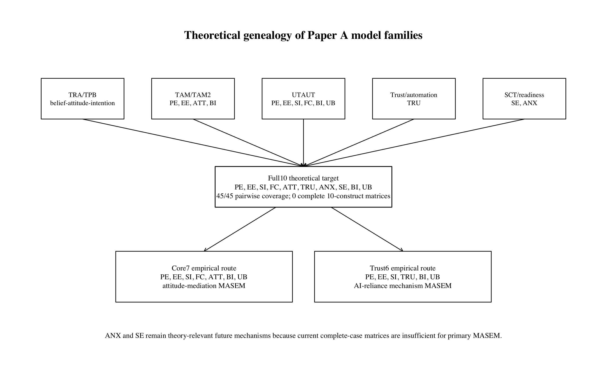
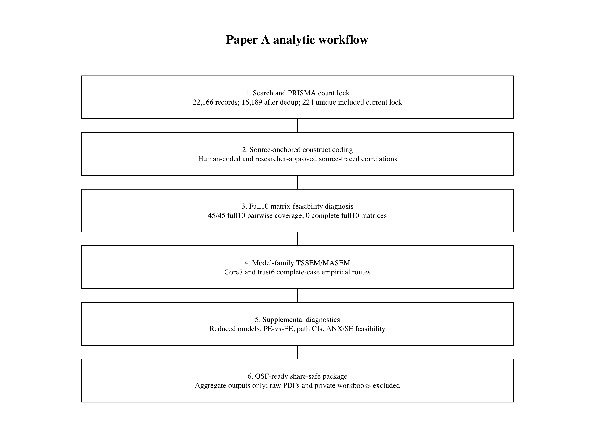
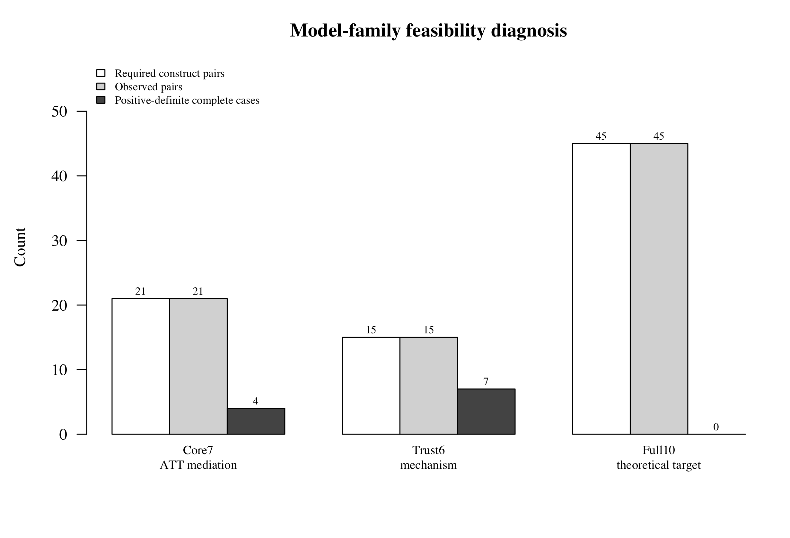
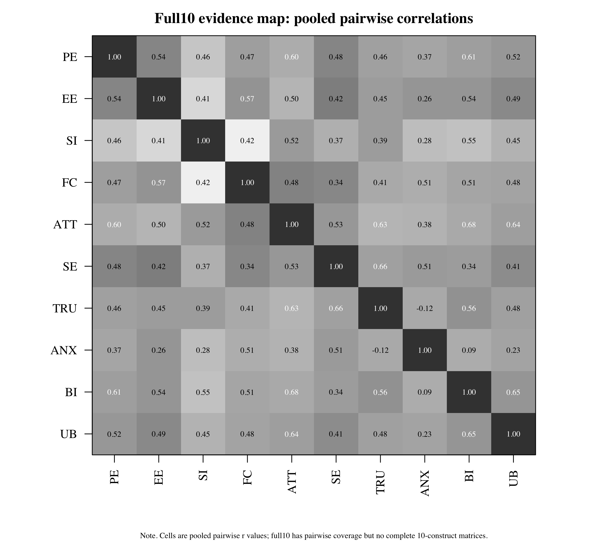
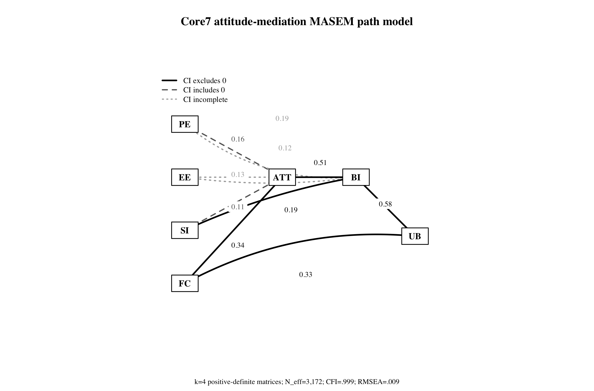
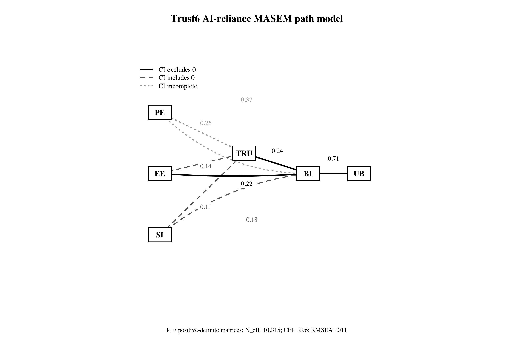
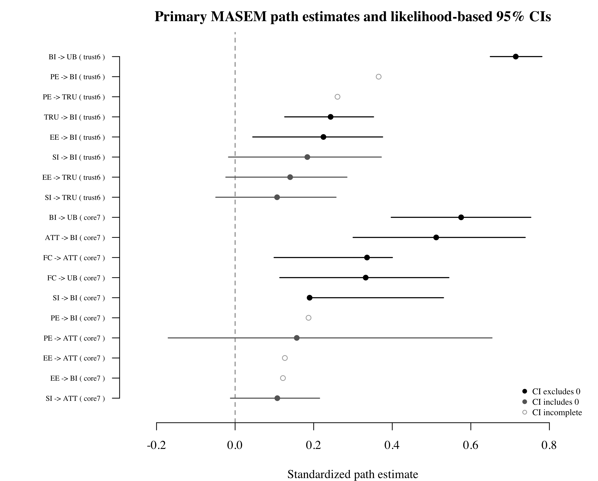

# From Integrated Theory to Estimable Descendants: A Model-Family MASEM of AI Adoption in Education

Hosung You

The Pennsylvania State University

## Abstract

AI adoption research in education draws on technology acceptance, unified acceptance, trust, self-efficacy, and anxiety traditions, but primary studies rarely report complete correlation matrices needed to test the full theoretical system. This study uses model-family meta-analytic structural equation modeling (MASEM) to distinguish theoretical coverage from empirical estimability. A 10-construct target model was specified with performance expectancy, effort expectancy, social influence, facilitating conditions, attitude, trust, anxiety, self-efficacy, behavioral intention, and use behavior. The current reporting set includes 224 unique reports/studies after merging one duplicate DOI row from 225 included screening rows. The full10 target populated all 45 pairwise cells in the current diagnostic input but had zero positive-definite complete-case 10-construct matrices, so it is reported as a theory/evidence map rather than as a single SEM estimate. Two complete-case model-family descendants were estimated: a core7 attitude-centered route (k = 4; N_eff = 3,172) and a trust6 trust-reliance route (k = 7; N_eff = 10,315). Results support attitude and trust as proximal adoption routes, but they do not confirm full belief-to-attitude or trust mediation chains. Anxiety and self-efficacy remain theory-retained but empirically underidentified. The study contributes a theory-preserving estimability diagnosis of AI adoption mechanisms and identifies the reporting improvements needed for future full-network MASEM.

Keywords: artificial intelligence adoption, education, MASEM, technology acceptance, trust, self-efficacy, anxiety

## Introduction

Artificial intelligence (AI) systems are becoming routine objects of adoption decisions in higher education, yet the literature explaining those decisions remains theoretically rich and structurally underreported. Individual studies commonly invoke the Technology Acceptance Model (TAM), the Unified Theory of Acceptance and Use of Technology (UTAUT), the theory of planned behavior, social cognitive theory, and trust-in-automation perspectives, but they rarely report complete correlation matrices that would permit a single integrated structural model. The result is a field with broad conceptual coverage but uneven empirical estimability.

This article addresses that tension by treating AI adoption theory as a theory-preserving estimability problem. Rather than forcing all available constructs into a single structural equation model, we first define a 10-construct theoretical target and then evaluate which theoretically interpretable descendants can be estimated from source-supported same-study correlation matrices. This approach is especially important for AI adoption because AI-specific mechanisms such as trust, anxiety, and self-efficacy are theoretically central but less consistently co-measured than performance expectancy, effort expectancy, social influence, attitude, intention, and use behavior.

The central contribution is therefore not a definitive full AI adoption SEM. Instead, the study contributes a model-family MASEM framework that shows what the current AI adoption literature can and cannot support. The full10 framework is retained as a theoretical target and evidence map. The core7 and trust6 routes are estimated as complete-case model-family descendants. Anxiety and self-efficacy are retained as theory-relevant mechanisms whose current underidentification is itself a field-level reporting finding.

## Theoretical Framework

The model begins from classic acceptance theory. TAM distinguishes perceived usefulness from perceived ease of use and links these beliefs to attitude, intention, and use. UTAUT broadens this grammar by adding social influence and facilitating conditions, while TRA and TPB give attitude and intention their broader motivational interpretation. These frameworks justify performance expectancy, effort expectancy, social influence, facilitating conditions, attitude, behavioral intention, and use behavior as the core adoption pathway.

AI adoption also requires a reliance-oriented extension. Trust is not merely another favorable attitude; in AI contexts it concerns whether users are willing to rely on opaque, probabilistic, or imperfect systems. The trust6 route therefore treats trust as a proximal trust-reliance construct linking AI-related beliefs to intention and use. This wording is intentionally conservative: the current evidence supports trust as an additional proximal route to behavioral intention, not a fully confirmed mediation chain from beliefs through trust.

Self-efficacy and anxiety remain theoretically important but empirically less estimable in the current corpus. Self-efficacy should shape effort beliefs and may reduce anxiety or directly support intention, whereas anxiety should operate as a threat or unease mechanism that can inhibit trust, attitude, intention, or use. In this manuscript, these constructs are not treated as moderators and are not treated as failed hypotheses. They are retained as future mechanisms whose structural role requires denser source reporting.

Model families were not chosen because the full10 model failed. They were defined as theoretically interpretable descendants of the full10 target before empirical feasibility was evaluated. Each estimable descendant had to preserve the adoption grammar of beliefs, proximal motivational mechanisms, and behavioral outcomes; use source-supported zero-order correlations; and contain positive-definite complete-case matrices. This rule makes the model-family strategy a theory-preserving diagnostic rather than a post hoc search for convenient fit.

## Method

The review followed a PRISMA 2020-oriented workflow. Database searches identified 22,166 records. After 5,977 duplicate records were removed, 16,189 records entered screening. Human review was applied to 657 records, of which 225 rows were coded as included. A duplicate DOI audit identified one duplicate included DOI row, yielding a current reporting set of 224 unique included reports/studies. The local automated PDF retrieval log contained 89 downloaded PDFs and 136 not downloaded or access-needed records; these retrieval counts are reported separately from final full-text eligibility because automated local retrieval is not equivalent to source-locked full-text assessment.

Construct coding was source anchored. Constructs were harmonized into PE, EE, SI, FC, ATT, TRU, ANX, SE, BI, and UB only when the source measure and reported correlation table supported the mapping. The coding rules preserved PE and EE as distinct mechanisms; treated S048 INT as BI and S048 USE as UB; rejected PKC -> SE for S004 unless reopened by a later adjudication decision; and excluded beta coefficients, path coefficients, HTMT values, loadings, or theory-only relations from primary zero-order correlation inputs.

The primary analytic target was a 10-construct AI adoption framework. Before estimating structural models, we diagnosed matrix feasibility by required pairwise coverage, observed pairwise coverage, partial-study availability, and positive-definite complete-case matrices. The full10 target reached 45 of 45 observed pairwise cells in the current diagnostic input, but no study provided a complete positive-definite 10-construct matrix. We therefore report full10 as an evidence map and not as a single SEM estimate.

Two empirical model-family descendants were then estimated from complete positive-definite study matrices. The core7 attitude-centered route included PE, EE, SI, FC, ATT, BI, and UB. The trust6 trust-reliance route included PE, EE, SI, TRU, BI, and UB. Both models were estimated as complete-case model-family MASEM routes using the same analysis package released in the OSF repository. The reported fit indices and path estimates should be interpreted with the complete-case k values shown in the tables, not as corpus-wide confirmation of the full theoretical network.

Path inference is reported using likelihood-based confidence intervals. Because Stage 2 returned likelihood-based CIs but not finite standard errors or p values for all paths, path labels are intentionally limited to three categories: CI-supported positive, CI includes zero, and CI incomplete/indeterminate. The manuscript avoids path-level significance language and treats incomplete intervals as indeterminate rather than as evidence for or against an effect.

Supplemental model-family diagnostics examined reduced and alternative routes. These models are not reported as definitive nested model-selection tests because construct removal can alter the complete-case study set, degrees of freedom, and matrix structure. They are used as sensitivity diagnostics to clarify whether the core theoretical interpretation is robust enough for cautious discussion.

### Table 1
Study Selection and Analytic Dataset Structure

| Item | Count | Source or interpretation |
| --- | --- | --- |
| Records identified from databases | 22,166 | Database search exports and deduplication log |
| Duplicate records removed | 5,977 | Deduplication log |
| Records screened after deduplication | 16,189 | Deduplicated screening set |
| Records excluded before human review | 15,532 | Records screened minus human-reviewed records |
| Human-reviewed records | 657 | Consolidated human screening file |
| Human-reviewed excluded rows | 432 | Human exclusion decisions |
| Human-reviewed included rows | 225 | Human include decisions |
| Duplicate included DOI rows merged | 1 | Duplicate DOI audit |
| Unique included reports/studies for current reporting | 224 | 225 included rows minus 1 duplicate DOI row |
| Local automated PDFs downloaded | 89 | Local automated retrieval log; not final full-text eligibility |
| Local automated PDFs not downloaded/access needed | 136 | Local automated retrieval log; manual/library retrieval may differ |

Note. Local automated PDF retrieval is separated from final full-text eligibility because local retrieval logs are not equivalent to source-locked eligibility decisions.

### Figure 1
PRISMA 2020 Flow Diagram for Paper A

Note. The figure reports the current repository-locked PRISMA-style counts; final full-text exclusion boxes should be source-locked before journal submission.

### Table 2
Construct Harmonization and Model-Family Role

| Label | Construct | Origin | Function | Role | Accepted mapping | Guardrail |
| --- | --- | --- | --- | --- | --- | --- |
| PE | Performance expectancy / perceived usefulness | TAM; UTAUT | Instrumental usefulness and expected outcome improvement | full10; core7; trust6 | Accepted as usefulness/performance belief; distinct from EE | Do not collapse with EE |
| EE | Effort expectancy / perceived ease of use | TAM; UTAUT; computer self-efficacy lineage | Operational ease, usability burden, and learning effort | full10; core7; trust6 | Accepted as ease/effort belief; distinct from PE | Do not infer PE-EE equivalence from high correlations |
| SI | Social influence | UTAUT; TPB subjective norm lineage | Normative and institutional endorsement | full10; core7; trust6 | Accepted as normative/social pressure or influence | Do not treat as institutional support |
| FC | Facilitating conditions | UTAUT | Resources, support, and infrastructure enabling use | full10; core7 | Accepted for resource/support conditions | Omitted from trust6 to isolate trust-reliance route |
| ATT | Attitude | TRA/TPB; TAM | Evaluative response linking beliefs to intention | full10; core7 | Accepted as attitude/evaluation toward AI/technology use | Report as attitude-centered route, not fully confirmed mediation |
| TRU | Trust in AI/technology | Trust in automation; trust in IS; AI reliance | Reliance under opacity, uncertainty, and vulnerability | full10; trust6 | Accepted as trust/reliance belief when source reports zero-order correlations | Do not claim full mediation unless indirect paths are supported |
| ANX | AI or technology anxiety | Technology readiness; acceptance barrier traditions | Threat, unease, or affective inhibition around AI use | full10; future mechanism | Retained when target source measures anxiety/threat construct | Underidentified; do not report as unsupported hypothesis |
| SE | Self-efficacy | Social cognitive theory; computer self-efficacy | Capability belief shaping effort, anxiety, and adoption intention | full10; future mechanism | Retained for self-/computer-/AI-efficacy when source-mapped | PKC -> SE rejected for S004 unless reopened |
| BI | Behavioral intention | TRA/TPB; TAM; UTAUT | Proximal motivational adoption outcome | full10; core7; trust6 | S048 INT accepted as BI | Do not merge with actual use behavior |
| UB | Use behavior | TAM; UTAUT | Behavioral adoption/use outcome | full10; core7; trust6 | S048 USE accepted as UB | Do not replace with BI |

### Figure 2
Theoretical Genealogy of Paper A Model Families

Note. The model families are theory-preserving descendants of the full10 target.

### Figure 3
Paper A Analytic Workflow

Note. The workflow separates count locking, construct harmonization, matrix diagnosis, model-family MASEM, supplemental diagnostics, and share-safe OSF release.

### Table 3
Model-Family Membership and Estimability Rules

| Model family | Constructs | Required pairs | Observed pairs | Partial studies | Positive-definite complete cases | Interpretation |
| --- | --- | --- | --- | --- | --- | --- |
| full10 theoretical target | PE, EE, SI, FC, ATT, TRU, ANX, SE, BI, UB | 45 | 45 | 77 | 0 | Theory-preserving evidence map; not a single current SEM estimate |
| core7 attitude-centered route | PE, EE, SI, FC, ATT, BI, UB | 21 | 21 | 72 | 4 | Primary complete-case model-family estimate; small-k boundary retained |
| trust6 trust-reliance route | PE, EE, SI, TRU, BI, UB | 15 | 15 | 73 | 7 | Primary complete-case model-family estimate; trust as proximal reliance route |

### Figure 4
Model-Family Feasibility Diagnosis

Note. The full10 target has complete pairwise coverage but no positive-definite complete-case 10-construct matrices.

## Results

The results are organized around the central distinction between theoretical coverage and empirical estimability. The full10 target has broad pairwise coverage, but complete-case full10 SEM estimation remains unsupported. Empirical MASEM evidence is therefore reported through the core7 and trust6 model-family descendants.

The core7 route converged with four positive-definite complete-case studies and an effective sample size of 3,172. The trust6 route converged with seven positive-definite complete-case studies and an effective sample size of 10,315. Fit indices were favorable for both routes, but these values must be read in light of the small complete-case k values.

### Figure 5
Full10 Evidence Map

Note. Cells represent populated pairwise evidence in the theory target; this is not a full10 SEM estimate.

### Table 4
Primary Model-Family MASEM Fit

| Model | k | N_eff | chi-square | df | p | CFI | TLI | RMSEA | SRMR |
| --- | --- | --- | --- | --- | --- | --- | --- | --- | --- |
| Core7 ATT mediation | 4 | 3172 | 6.146 | 5 | .292 | 0.999 | 0.996 | 0.009 | 0.043 |
| Trust6 trust mechanism | 7 | 10315 | 8.957 | 4 | .062 | 0.996 | 0.985 | 0.011 | 0.040 |

Note. Fit values are complete-case model-family estimates and should be interpreted with the small k values shown.

The clearest core7 paths were FC -> ATT, SI -> BI, ATT -> BI, FC -> UB, and BI -> UB. PE -> ATT and SI -> ATT had CIs including zero, while EE -> ATT and direct PE/EE -> BI paths had incomplete intervals. Thus, the evidence supports attitude as a robust proximal evaluative route to intention, but it does not fully recover the classic belief-to-attitude mediation chain.

In the trust6 route, TRU -> BI and BI -> UB were CI-supported positive paths, and EE -> BI was also CI-supported. PE -> TRU and PE -> BI remained indeterminate because of incomplete intervals; EE -> TRU, SI -> TRU, and SI -> BI had intervals including zero. These results support trust as an additional proximal trust-reliance route, not a fully confirmed trust mediation model.

### Table 5
Primary Structural Path Estimates

| Model | From | To | Estimate | 95% CI | Inference |
| --- | --- | --- | --- | --- | --- |
| Core7 ATT mediation | PE | ATT | 0.157 | [-0.170, 0.654] | CI includes zero |
| Core7 ATT mediation | EE | ATT | 0.127 | [NA, NA] | CI incomplete/indeterminate |
| Core7 ATT mediation | SI | ATT | 0.107 | [-0.012, 0.215] | CI includes zero |
| Core7 ATT mediation | FC | ATT | 0.336 | [0.099, 0.400] | CI-supported positive |
| Core7 ATT mediation | PE | BI | 0.187 | [NA, 0.582] | CI incomplete/indeterminate |
| Core7 ATT mediation | EE | BI | 0.122 | [NA, 0.347] | CI incomplete/indeterminate |
| Core7 ATT mediation | SI | BI | 0.190 | [0.190, 0.530] | CI-supported positive |
| Core7 ATT mediation | ATT | BI | 0.512 | [0.300, 0.738] | CI-supported positive |
| Core7 ATT mediation | FC | UB | 0.332 | [0.114, 0.544] | CI-supported positive |
| Core7 ATT mediation | BI | UB | 0.575 | [0.397, 0.753] | CI-supported positive |
| Trust6 trust mechanism | PE | TRU | 0.261 | [NA, 0.438] | CI incomplete/indeterminate |
| Trust6 trust mechanism | EE | TRU | 0.140 | [-0.024, 0.285] | CI includes zero |
| Trust6 trust mechanism | SI | TRU | 0.107 | [-0.049, 0.257] | CI includes zero |
| Trust6 trust mechanism | PE | BI | 0.365 | [NA, 0.512] | CI incomplete/indeterminate |
| Trust6 trust mechanism | EE | BI | 0.225 | [0.045, 0.375] | CI-supported positive |
| Trust6 trust mechanism | SI | BI | 0.184 | [-0.017, 0.372] | CI includes zero |
| Trust6 trust mechanism | TRU | BI | 0.243 | [0.126, 0.352] | CI-supported positive |
| Trust6 trust mechanism | BI | UB | 0.714 | [0.650, 0.781] | CI-supported positive |

Note. Path inference uses CI-supported, CI includes zero, and CI incomplete/indeterminate categories; path p values are not reported.

### Figure 6
Core7 Attitude-Centered Path Model

Note. Solid paths indicate CI-supported positive paths; dashed paths include zero; dotted paths have incomplete intervals.

### Figure 7
Trust6 Trust-Reliance Path Model

Note. Trust is interpreted as a proximal trust-reliance route, not as a fully confirmed mediator.

### Figure 8
Primary Path Estimate Coefficient Plot

Note. Horizontal bars are likelihood-based 95% confidence intervals where available.

### Table 6
Supplemental Reduced and Alternative Model-Family Diagnostics

| Model ID | Family | k | Status | chi-square | df | p | CFI | RMSEA | AIC |
| --- | --- | --- | --- | --- | --- | --- | --- | --- | --- |
| core7_full | core7_attitude | 4 | converged | 6.146 | 5 | .292 | 0.999 | 0.009 | -3.854 |
| core6_no_ATT_direct_beliefs | core7_attitude | 17 | converged | 1.780 | 3 | .619 | 1.000 | 0.000 | -4.220 |
| core7_pure_ATT_mediation_no_direct_belief_BI | core7_attitude | 4 | status_6 | 18.318 | 8 | .019 | 0.991 | 0.020 | 2.318 |
| trust6_full | trust6_mechanism | 7 | converged | 8.957 | 4 | .062 | 0.996 | 0.011 | 0.957 |
| trust5_no_TRU_direct_acceptance | trust6_mechanism | 20 | converged | 6.496 | 3 | .090 | 0.997 | 0.008 | 0.496 |
| trust6_trust_mediator_no_direct_belief_BI | trust6_mechanism | 7 | converged | 150.683 | 7 | < .001 | 0.888 | 0.045 | 136.683 |
| se4_capability_effort_intention | anx_se_feasibility | 2 | status_6 | 2.916 | 2 | .233 | 0.999 | 0.022 | -1.084 |

Note. These comparisons are diagnostic rather than definitive nested model-selection tests because construct removal can change the complete-case matrix set.

The PE versus EE comparison preserved their conceptual distinction. PE represents expected performance improvement, whereas EE represents operational ease or burden. The estimates suggested uneven role differentiation: EE -> BI was CI-supported in the trust6 route, but multiple PE paths had incomplete intervals. The safest interpretation is that the current model family preserves the PE/EE distinction and shows suggestive differentiation without claiming a stable contrast across all outcomes.

ANX and SE were retained in the theoretical target but remained empirically underidentified. The only targeted SE route with positive-definite complete cases involved SE, EE, BI, and UB with k = 2 and status_6; other anxiety and self-efficacy routes had no positive-definite complete-case matrices. This pattern should be read as evidence of structural underreporting, not as evidence that anxiety or self-efficacy are unimportant.

### Table 7
Performance Expectancy and Effort Expectancy as Distinct Mechanisms

| Model | Predictor | Target | Estimate | 95% CI | Inference |
| --- | --- | --- | --- | --- | --- |
| Core7 ATT mediation | PE | ATT | 0.157 | [-0.170, 0.654] | CI includes zero |
| Core7 ATT mediation | EE | ATT | 0.127 | [NA, NA] | CI incomplete/indeterminate |
| Core7 ATT mediation | PE | BI | 0.187 | [NA, 0.582] | CI incomplete/indeterminate |
| Core7 ATT mediation | EE | BI | 0.122 | [NA, 0.347] | CI incomplete/indeterminate |
| Trust6 trust mechanism | PE | TRU | 0.261 | [NA, 0.438] | CI incomplete/indeterminate |
| Trust6 trust mechanism | EE | TRU | 0.140 | [-0.024, 0.285] | CI includes zero |
| Trust6 trust mechanism | PE | BI | 0.365 | [NA, 0.512] | CI incomplete/indeterminate |
| Trust6 trust mechanism | EE | BI | 0.225 | [0.045, 0.375] | CI-supported positive |

### Table 8
Anxiety and Self-Efficacy Feasibility Attempts

| Model ID | Constructs | Positive-definite complete cases | Stage 1 | Stage 2 | CFI | RMSEA | Rationale |
| --- | --- | --- | --- | --- | --- | --- | --- |
| se4_capability_effort_intention | SE,EE,BI,UB | 2 | status_6 | status_6 | 0.999 | 0.022 | Self-efficacy feasibility: capability -> effort/intention. |
| se4_capability_attitude_intention | SE,ATT,BI,UB | 0 | not_run | not_run | NA | NA | Self-efficacy feasibility: capability -> attitude/intention. |
| anx4_threat_attitude_intention | ANX,ATT,BI,UB | 0 | not_run | not_run | NA | NA | Anxiety feasibility: threat affect -> attitude/intention. |
| anx4_trust_threat_reliance | ANX,TRU,BI,UB | 0 | not_run | not_run | NA | NA | Anxiety feasibility: threat -> trust/reliance/intention. |
| se_anx_bi_capability_threat | SE,ANX,BI,UB | 0 | not_run | not_run | NA | NA | Capability-threat feasibility: self-efficacy and anxiety as competing mechanisms. |
| se_anx_tru_bi | SE,ANX,TRU,BI | 0 | not_run | not_run | NA | NA | Capability-threat-trust feasibility scan without use behavior. |

## Discussion

This study reframes AI adoption meta-analysis as a theory-preserving estimability diagnosis. The current literature contains enough pairwise evidence to populate a 10-construct AI adoption evidence map, but not enough same-study complete matrix evidence to estimate the entire theoretical network as one SEM. That distinction is the manuscript's main contribution. It allows the field to see both the conceptual ambition of AI adoption theory and the reporting limitations that currently prevent full structural synthesis.

The attitude-centered route provides partial support for classic acceptance logic. ATT -> BI was consistently supported, and FC showed positive links to both ATT and UB. However, the expected belief-to-attitude chain was not uniformly recovered. PE and EE should therefore remain theoretically central, but the present complete-case MASEM evidence does not justify claiming that the full TAM mediation sequence has been confirmed in AI adoption research.

The trust-reliance route adds an AI-specific contribution. Trust was positively associated with behavioral intention after accounting for PE, EE, and SI, supporting the view that AI adoption depends not only on usefulness and ease but also on appropriate reliance. At the same time, the antecedent paths into trust were incomplete or not CI-supported. Trust should therefore be described as a proximal reliance route rather than as a proven mediator.

The underidentification of anxiety and self-efficacy is theoretically informative. These constructs are not peripheral to AI adoption; they describe threat and capability mechanisms that are likely to shape ease, trust, attitude, intention, and use. Their current absence from estimable model-family routes indicates that primary studies need to report denser, source-compatible correlation matrices if the field wants to test these mechanisms structurally.

Methodologically, the model-family strategy offers a defensible alternative to forcing a non-estimable full model or repairing matrices in ways that change the estimand. By retaining full10 as an evidence map and estimating only theory-consistent positive-definite complete-case descendants, the analysis makes the empirical boundary visible. This is a conservative route, but it is preferable to treating incompatible pairwise evidence as if it supported one complete AI adoption SEM.

Several limitations remain. First, the full10 model is not estimated as a single SEM. Second, the core7 and trust6 routes rest on small complete-case k values, so influence diagnostics should be added before making strong field-level claims. Third, several paths have incomplete confidence intervals, and these paths are reported as indeterminate. Fourth, supplemental reduced models change matrix structure and sometimes complete-case k, so they are diagnostic rather than definitive nested tests. Fifth, the final full-text eligibility boxes and duplicate DOI interpretation should be source-locked before journal submission.

Future work should improve correlation reporting in AI adoption studies, especially for anxiety, self-efficacy, trust, attitude, intention, and use behavior measured in the same samples. Future syntheses should also examine influence diagnostics, missing-correlation MASEM sensitivity where assumptions are defensible, and mechanism-specific extensions that can separate capability, threat, reliance, and evaluative routes.

In conclusion, AI adoption theory is ahead of the field's current matrix reporting practice. The present study shows how model-family MASEM can preserve the theoretical target while making empirical estimability explicit. The strongest defensible claim is not that the field now has a complete structural model of AI adoption, but that the field now has a transparent map of which mechanisms are estimable, which are promising, and which remain structurally underreported.

## Data Availability

The share-safe Paper A public repository package is available in the Paper A OSF component at https://osf.io/bwzgc/overview. The uploaded file is public_data_repository_20260615_osf_ready.zip. The package includes share-safe manuscripts, aggregate results, figures, analysis scripts, reference review manifests, PRISMA count-lock files, and manifest checksums. Raw PDFs, private source documents, raw coder workbooks, and runtime files are excluded from the public package.

## References

- Ajzen, I. (1991). The theory of planned behavior. *Organizational Behavior and Human Decision Processes, 50*(2), 179-211. https://doi.org/10.1016/0749-5978(91)90020-T

- Bandura, A. (1977). Self-efficacy: Toward a unifying theory of behavioral change. *Psychological Review, 84*(2), 191-215. https://doi.org/10.1037/0033-295X.84.2.191

- Cheung, M. W.-L. (2014). Fixed- and random-effects meta-analytic structural equation modeling: Examples and analyses in R. *Behavior Research Methods, 46*(1), 29-40. https://doi.org/10.3758/s13428-013-0361-y

- Cheung, M. W.-L. (2015). *Meta-analysis: A structural equation modeling approach*. Wiley.

- Cheung, M. W.-L. (2015). metaSEM: An R package for meta-analysis using structural equation modeling. *Frontiers in Psychology, 5*, Article 1521. https://doi.org/10.3389/fpsyg.2014.01521

- Cheung, M. W.-L., & Chan, W. (2005). Meta-analytic structural equation modeling: A two-stage approach. *Psychological Methods, 10*(1), 40-64. https://doi.org/10.1037/1082-989X.10.1.40

- Compeau, D. R., & Higgins, C. A. (1995). Computer self-efficacy: Development of a measure and initial test. *MIS Quarterly, 19*(2), 189-211. https://doi.org/10.2307/249688

- Davis, F. D. (1989). Perceived usefulness, perceived ease of use, and user acceptance of information technology. *MIS Quarterly, 13*(3), 319-340. https://doi.org/10.2307/249008

- Davis, F. D., Bagozzi, R. P., & Warshaw, P. R. (1989). User acceptance of computer technology: A comparison of two theoretical models. *Management Science, 35*(8), 982-1003. https://doi.org/10.1287/mnsc.35.8.982

- Fishbein, M., & Ajzen, I. (1975). *Belief, attitude, intention, and behavior: An introduction to theory and research*. Addison-Wesley.

- Gefen, D., Karahanna, E., & Straub, D. W. (2003). Trust and TAM in online shopping: An integrated model. *MIS Quarterly, 27*(1), 51-90. https://doi.org/10.2307/30036519

- Glikson, E., & Woolley, A. W. (2020). Human trust in artificial intelligence: Review of empirical research. *Academy of Management Annals, 14*(2), 627-660. https://doi.org/10.5465/annals.2018.0057

- Jak, S., & Cheung, M. W.-L. (2018). Accounting for missing correlation coefficients in fixed-effects MASEM. *Multivariate Behavioral Research, 53*(1), 1-14. https://doi.org/10.1080/00273171.2017.1375886

- Jak, S., & Cheung, M. W.-L. (2020). Meta-analytic structural equation modeling with moderating effects on SEM parameters. *Psychological Methods, 25*(4), 430-455. https://doi.org/10.1037/met0000245

- Jak, S., & Cheung, M. W.-L. (2024). A cautionary note on using univariate methods for meta-analytic structural equation modeling. *Advances in Methods and Practices in Psychological Science, 7*(4). https://doi.org/10.1177/25152459241274249

- Kelly, S., Kaye, S.-A., & Oviedo-Trespalacios, O. (2023). What factors contribute to the acceptance of artificial intelligence? A systematic review. *Telematics and Informatics, 77*, Article 101925. https://doi.org/10.1016/j.tele.2022.101925

- King, W. R., & He, J. (2006). A meta-analysis of the technology acceptance model. *Information & Management, 43*(6), 740-755. https://doi.org/10.1016/j.im.2006.05.003

- Labadze, L., Grigolia, M., & Machaidze, L. (2023). Role of AI chatbots in education: Systematic literature review. *International Journal of Educational Technology in Higher Education, 20*, Article 56. https://doi.org/10.1186/s41239-023-00426-1

- Landis, R. S. (2013). Successfully combining meta-analysis and structural equation modeling: Recommendations and strategies. *Journal of Business and Psychology, 28*, 251-261. https://doi.org/10.1177/1094428112464967

- Lee, J. D., & See, K. A. (2004). Trust in automation: Designing for appropriate reliance. *Human Factors, 46*(1), 50-80. https://doi.org/10.1518/hfes.46.1.50_30392

- Marakas, G. M., Yi, M. Y., & Johnson, R. D. (1998). The multilevel and multifaceted character of computer self-efficacy. *Information Systems Research, 9*(2), 126-163. https://doi.org/10.1287/isre.9.2.126

- Meuter, M. L., Ostrom, A. L., Bitner, M. J., & Roundtree, R. (2003). The influence of technology anxiety on consumer use and experiences with self-service technologies. *Journal of Business Research, 56*(11), 899-906. https://doi.org/10.1016/S0148-2963(01)00276-4

- Page, M. J., McKenzie, J. E., Bossuyt, P. M., Boutron, I., Hoffmann, T. C., Mulrow, C. D., et al. (2021). The PRISMA 2020 statement: An updated guideline for reporting systematic reviews. *BMJ, 372*, n71. https://doi.org/10.1136/bmj.n71

- Parasuraman, A. (2000). Technology Readiness Index (TRI): A multiple-item scale to measure readiness to embrace new technologies. *Journal of Service Research, 2*(4), 307-320. https://doi.org/10.1177/109467050024001

- Scherer, R., Siddiq, F., & Tondeur, J. (2019). The technology acceptance model: A meta-analytic structural equation modeling approach to explaining teachers' adoption of digital technology in education. *Computers & Education, 128*, 13-35. https://doi.org/10.1016/j.compedu.2018.09.009

- Strzelecki, A. (2024). To use or not to use ChatGPT in higher education? A study of students' acceptance and use of technology. *Interactive Learning Environments, 32*(9), 5142-5155. https://doi.org/10.1080/10494820.2023.2209881

- Valentine, J. C., Cheung, M. W.-L., Smith, E. J., Alexander, O., Hatton, J. M., Hong, R. Y., Huckaby, L. T., Patton, S. C., Possel, P., & Seely, H. D. (2022). A primer on meta-analytic structural equation modeling. *Prevention Science, 23*(3), 346-365. https://doi.org/10.1007/s11121-021-01298-5

- Venkatesh, V. (2000). Determinants of perceived ease of use: Integrating control, intrinsic motivation, and emotion into the Technology Acceptance Model. *Information Systems Research, 11*(4), 342-365. https://doi.org/10.1287/isre.11.4.342.11872

- Venkatesh, V., & Davis, F. D. (2000). A theoretical extension of the Technology Acceptance Model: Four longitudinal field studies. *Management Science, 46*(2), 186-204. https://doi.org/10.1287/isre.11.2.186.11752

- Venkatesh, V., Morris, M. G., Davis, G. B., & Davis, F. D. (2003). User acceptance of information technology: Toward a unified view. *MIS Quarterly, 27*(3), 425-478. https://doi.org/10.2307/30036540

- Venkatesh, V., Thong, J. Y. L., & Xu, X. (2012). Consumer acceptance and use of information technology: Extending the unified theory of acceptance and use of technology. *MIS Quarterly, 36*(1), 157-178. https://doi.org/10.2307/41410412

- Xue, L., Rashid, A. M., & Ouyang, S. (2024). The Unified Theory of Acceptance and Use of Technology (UTAUT) in higher education: A systematic review. *SAGE Open, 14*(1). https://doi.org/10.1177/21582440241229570

- Xue, L., Mahat, J., & Ghazali, N. (2026). Technology Acceptance Model in artificial intelligence in education: A meta-analysis. *SAGE Open, 16*(1). https://doi.org/10.1177/21582440251409441

- Yousafzai, S. Y., Foxall, G. R., & Pallister, J. G. (2007). Technology acceptance: A meta-analysis of the TAM: Part 1. *Journal of Modelling in Management, 2*(3), 251-280. https://doi.org/10.1108/17465660710834453
