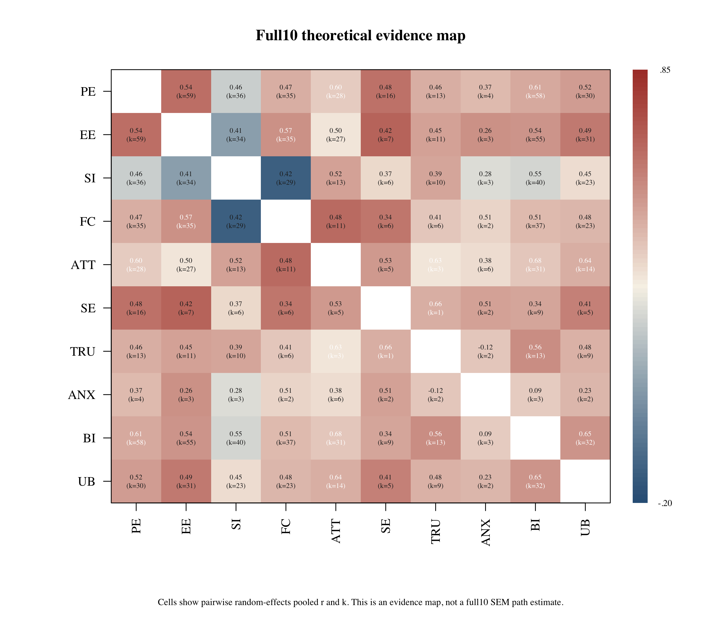
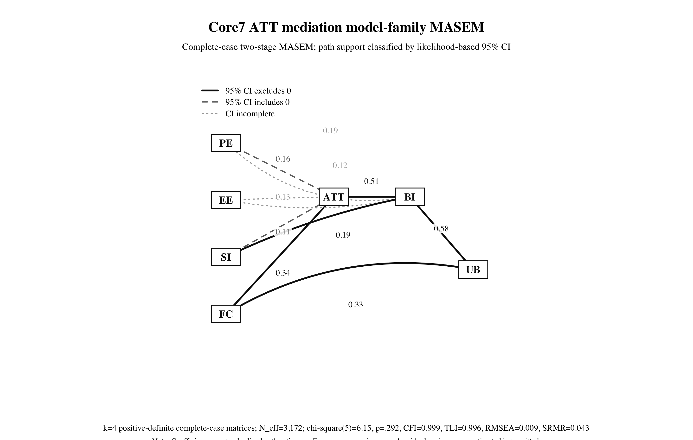
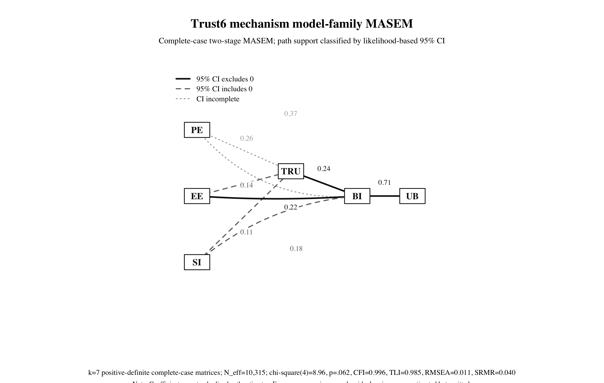

# AI Adoption in Higher Education: A Meta-Analytic Structural Equation Modeling Study

Target journal: Computers & Education

Draft date: 2026-06-15

## Submission Package State

This target-journal draft supersedes the 2026-06-12/2026-06-14 analysis boundary. The 2026-06-15 researcher-approved rerun promoted seven S048 Table 2 source-visible Pearson correlations into Paper A supplemental analysis provenance without mutating the Paper B source-anchored adjudicated human reference standard. The updated analysis supports a model-family MASEM manuscript structure: the full 10-construct framework is retained as the theoretical evidence map, while the empirically estimable structural results are reported through complete-case core7 and trust6 MASEM routes.

Current claim boundary:

- Full10 is the theoretical target and evidence map, not a converged single SEM estimate.
- Core7 attitude mediation and trust6 trust mechanism are the converged empirical model-family MASEM results.
- Trust, anxiety, and self-efficacy are mechanism constructs, not study-level moderators. Trust is estimable in the current empirical model family; anxiety and self-efficacy remain theory-relevant full10/supplementary mechanism candidates.
- Path-level support is classified by likelihood-based 95% confidence intervals from Stage 2 because finite standard errors and z-based path p values were not returned.

## Highlights

- Synthesizes AI adoption evidence in higher education with MASEM.
- Integrates TAM/UTAUT predictors with trust and AI anxiety.
- Separates direct-r inputs from converted sensitivity evidence.
- Tests structural and moderator paths across ten constructs.
- Provides reproducible extraction and QC artifacts.

## Abstract

Artificial intelligence tools are increasingly embedded in higher education, but the empirical adoption literature remains fragmented across constructs, samples, tools, and reporting formats. This study synthesizes higher-education AI adoption evidence using meta-analytic structural equation modeling. The theoretical target integrated performance expectancy, effort expectancy, social influence, facilitating conditions, attitude, self-efficacy, trust in AI, AI anxiety, behavioral intention, and use behavior. Because the full 10-construct network reached complete pairwise coverage but had no complete same-study 10-construct matrices, and sparse partial-matrix TSSEM remained non-estimable, we used a model-family MASEM strategy. The full 10-construct framework was retained as the theoretical evidence map, while complete-case core7 and trust6 models were estimated as empirical structural submodels. The core7 attitude-mediation model and trust6 mechanism model both converged with strong global fit. In the core7 model, facilitating conditions predicted attitude and use behavior, attitude predicted behavioral intention, and behavioral intention predicted use behavior. In the trust6 model, trust predicted behavioral intention and behavioral intention predicted use behavior, supporting trust as an AI-specific mechanism in adoption. These findings provide a defensible structural synthesis of AI adoption in higher education while preserving explicit boundaries around non-estimable full-network claims.

Keywords: artificial intelligence; technology acceptance; higher education; MASEM; UTAUT; trust; anxiety

## Introduction

Artificial intelligence tools are now embedded in higher education through large language models, intelligent tutoring systems, automated assessment systems, writing assistants, recommendation tools, and analytics platforms. Their spread has produced a rapidly expanding empirical literature on adoption, acceptance, and use. Yet this literature remains difficult to interpret cumulatively because studies draw from overlapping but nonidentical acceptance frameworks, measure different subsets of constructs, and report evidence in formats that do not directly support a single structural synthesis.

Meta-analytic structural equation modeling is well suited to this problem because it can synthesize study-level correlation matrices and test a theory-guided network of relationships. In AI adoption research, this is especially important. Performance expectancy, effort expectancy, social influence, facilitating conditions, attitude, self-efficacy, behavioral intention, and use behavior provide continuity with TAM, TPB, and UTAUT. Trust in AI and AI anxiety capture psychological features of AI systems that are not fully reducible to general usefulness or ease-of-use beliefs.

The present study develops a MASEM of AI adoption in higher education that integrates traditional technology acceptance constructs with AI-specific psychological constructs. The working model treats attitude as a theoretically meaningful mediator rather than assuming that the parsimonious UTAUT exclusion of attitude applies unchanged to AI adoption contexts. It also tests whether trust, anxiety, and self-efficacy operate as AI-specific mechanism constructs where the correlation network supports indirect-effect estimation.

## Literature Review

[Reserved for team contribution. Use the Team Writing Brief in `docs/07_manuscript_exemplars/20260612/TEAM_WRITING_BRIEF_LIT_REVIEW_DISCUSSION_20260612.md`.]

## Method

### Design and Reporting

Paper A is the parent meta-analysis for the AI adoption evidence-synthesis project. It uses systematic-review procedures to identify eligible studies and applies TSSEM/OSMASEM to synthesize construct-level relationships. Reporting should align with PRISMA 2020 and Computers & Education submission requirements.

### Search, Screening, and Eligibility

The documented search workflow yielded 22,166 records. After deduplication, 16,189 records remained for screening. The final manuscript must harmonize the proposal-stage included-study count with the final locked full-text MASEM-eligible count before submission.

### Constructs and Model Architecture

The primary model uses 10 constructs: performance expectancy, effort expectancy, social influence, facilitating conditions, attitude, self-efficacy, trust in AI, AI anxiety, behavioral intention, and use behavior. The planned architecture places performance expectancy and effort expectancy upstream of attitude, attitude upstream of behavioral intention, behavioral intention upstream of use behavior, and trust/anxiety as AI-specific antecedents of behavioral intention.

### Analysis Plan

We treated the 10-construct AI adoption framework as the theoretical target and first evaluated whether the source-supported evidence base could sustain a single full-network MASEM. The target framework included performance expectancy, effort expectancy, social influence, facilitating conditions, attitude, self-efficacy, trust, AI anxiety, behavioral intention, and use behavior. Rows entered the primary analysis only when the correlation value and sample size were source-supported or researcher-approved with provenance.

Because no study supplied a complete 10-construct correlation matrix and sparse partial-matrix TSSEM produced non-positive-definite implied covariance structures, we did not force the full network into a single structural estimate. Instead, we used a model-family MASEM strategy. The full 10-construct network was retained as the theoretical evidence map. Empirically estimable submodels were then fit as complete-case TSSEM/MASEM models when all required construct pairs were present within a study and the resulting study-level correlation matrix was positive definite.

The empirical model family included two theory-consistent routes. The core7 attitude-mediation model estimated the central TAM/UTAUT adoption pathway among performance expectancy, effort expectancy, social influence, facilitating conditions, attitude, behavioral intention, and use behavior. The trust6 mechanism model estimated an AI-specific trust pathway among performance expectancy, effort expectancy, social influence, trust, behavioral intention, and use behavior. Stage 1 used random-effects TSSEM. Stage 2 fit the prespecified structural model to the pooled correlation matrix.

Path-level support was evaluated with likelihood-based 95% confidence intervals from Stage 2. Paths were interpreted as supported when the interval excluded zero. Because finite standard errors and z-based p values were not returned for individual paths, paths with incomplete intervals were flagged as indeterminate rather than treated as significant. OSMASEM or moderator meta-regression remains a separate analysis layer and is not used to reinterpret trust, anxiety, or self-efficacy as study-level moderators.

## Results

### Analysis-Ready Evidence Base

The 2026-06-15 researcher-approved input contains 836 analysis rows. Seven S048 Table 2 values were already present in the source-correction layer and were promoted to researcher-approved supplemental Paper A provenance without duplicate insertion. The full 10-construct target reached complete pairwise coverage across the source-supported evidence base: 45 of 45 construct pairs were available for pairwise pooled evidence mapping.

| Input or gate | Current value | Submission interpretation |
| --- | ---: | --- |
| Researcher-approved analysis input rows | 836 | Current Paper A model-family input after ANX/TRU, S121 PE-SE, and S048 supplemental approval |
| Full10 pairwise construct-pair coverage | 45/45 | Sufficient for a theoretical evidence map |
| Full10 complete-case studies | 0 | Not sufficient for a single full10 SEM estimate |
| Sparse partial-matrix TSSEM | Failed | Non-positive-definite implied covariance under sparse partial matrices |
| Core7 complete-case matrices | 4 | Empirically estimable model-family route |
| Trust6 complete-case matrices | 7 | Empirically estimable model-family route |

### Full10 Theoretical Evidence Map

The full 10-construct model remains the theoretical target because pairwise evidence exists for all 45 construct pairs. However, no study supplied a complete same-study 10-construct correlation matrix. Sparse partial-matrix TSSEM remained non-estimable because the implied covariance structure was not positive definite. Therefore, the full10 model is reported as a theoretical evidence map rather than as a single primary SEM result.

### Empirical Model-Family MASEM Fit

The reduced empirical model-family routes converged in complete-case TSSEM/MASEM. The core7 attitude-mediation model used four positive-definite complete-case matrices and fit the pooled matrix well. The trust6 mechanism model used seven positive-definite complete-case matrices and also showed strong fit.

| model_family | complete_case_k | effective_sample_size | chisq | df | p | CFI | TLI | RMSEA | SRMR | AIC | BIC |
| --- | --- | --- | --- | --- | --- | --- | --- | --- | --- | --- | --- |
| Core7 ATT mediation | 4 | 3172.000 | 6.146 | 5.000 | 0.292 | 0.999 | 0.996 | 0.009 | 0.043 | -3.854 | -34.165 |
| Trust6 trust mechanism | 7 | 10315.000 | 8.957 | 4.000 | 0.062 | 0.996 | 0.985 | 0.011 | 0.040 | 0.957 | -28.008 |

### Core7 Attitude-Mediation Model

The core7 model estimated the central TAM/UTAUT adoption pathway. Supported paths, defined by likelihood-based 95% confidence intervals excluding zero, were facilitating conditions to attitude, social influence to behavioral intention, attitude to behavioral intention, facilitating conditions to use behavior, and behavioral intention to use behavior. Performance expectancy to attitude and social influence to attitude had intervals that included zero. Effort expectancy to attitude, performance expectancy to behavioral intention, and effort expectancy to behavioral intention had incomplete likelihood-based intervals and are not interpreted as supported.

### Trust6 Mechanism Model

The trust6 model estimated an AI-specific trust pathway. Supported paths were effort expectancy to behavioral intention, trust to behavioral intention, and behavioral intention to use behavior. Effort expectancy to trust, social influence to trust, and social influence to behavioral intention had intervals that included zero. Performance expectancy to trust and performance expectancy to behavioral intention had incomplete likelihood-based intervals and are not interpreted as supported. The supported trust-to-intention path indicates that trust can be reported as an empirical AI-specific mechanism in the current model family. Anxiety and self-efficacy remain theory-relevant constructs in the full10 evidence map or future reduced extensions, but they are not confirmed mediators in the current converged MASEM results.

### Path-Level Inference Table

| model_family | parameter | estimate | ci_text | inference_symbol | inference_class |
| --- | --- | --- | --- | --- | --- |
| Core7 ATT mediation | PE_to_ATT | 0.157 | [-0.170, 0.654] | ns | not_supported_95ci_includes_zero |
| Core7 ATT mediation | EE_to_ATT | 0.127 | [NA, NA] | CI? | ci_incomplete |
| Core7 ATT mediation | SI_to_ATT | 0.107 | [-0.012, 0.215] | ns | not_supported_95ci_includes_zero |
| Core7 ATT mediation | FC_to_ATT | 0.336 | [0.099, 0.400] | CI+ | supported_positive_95ci |
| Core7 ATT mediation | PE_to_BI | 0.187 | [NA, 0.582] | CI? | ci_incomplete |
| Core7 ATT mediation | EE_to_BI | 0.122 | [NA, 0.347] | CI? | ci_incomplete |
| Core7 ATT mediation | SI_to_BI | 0.190 | [0.190, 0.530] | CI+ | supported_positive_95ci |
| Core7 ATT mediation | ATT_to_BI | 0.512 | [0.300, 0.738] | CI+ | supported_positive_95ci |
| Core7 ATT mediation | FC_to_UB | 0.332 | [0.114, 0.544] | CI+ | supported_positive_95ci |
| Core7 ATT mediation | BI_to_UB | 0.575 | [0.397, 0.753] | CI+ | supported_positive_95ci |
| Trust6 trust mechanism | PE_to_TRU | 0.261 | [NA, 0.438] | CI? | ci_incomplete |
| Trust6 trust mechanism | EE_to_TRU | 0.140 | [-0.024, 0.285] | ns | not_supported_95ci_includes_zero |
| Trust6 trust mechanism | SI_to_TRU | 0.107 | [-0.049, 0.257] | ns | not_supported_95ci_includes_zero |
| Trust6 trust mechanism | PE_to_BI | 0.365 | [NA, 0.512] | CI? | ci_incomplete |
| Trust6 trust mechanism | EE_to_BI | 0.225 | [0.045, 0.375] | CI+ | supported_positive_95ci |
| Trust6 trust mechanism | SI_to_BI | 0.184 | [-0.017, 0.372] | ns | not_supported_95ci_includes_zero |
| Trust6 trust mechanism | TRU_to_BI | 0.243 | [0.126, 0.352] | CI+ | supported_positive_95ci |
| Trust6 trust mechanism | BI_to_UB | 0.714 | [0.650, 0.781] | CI+ | supported_positive_95ci |

### Figure Captions

Figure 1. Full 10-construct theoretical evidence map. Cells report pairwise random-effects pooled correlations and the number of contributing studies for each construct pair. The figure is an evidence-map summary, not a full 10-construct SEM estimate, because no primary study supplied a complete 10-construct correlation matrix and sparse partial-matrix TSSEM did not yield a positive-definite implied covariance structure.

Figure 2. Core7 attitude-mediation complete-case MASEM path diagram. Solid black paths have likelihood-based 95% confidence intervals excluding zero, dashed gray paths have intervals including zero, and dotted light-gray paths have incomplete intervals and are not classified as supported. Exogenous covariances and residual variances were estimated but omitted from the diagram for readability.

Figure 3. Trust6 mechanism complete-case MASEM path diagram. Solid black paths have likelihood-based 95% confidence intervals excluding zero, dashed gray paths have intervals including zero, and dotted light-gray paths have incomplete intervals and are not classified as supported. Exogenous covariances and residual variances were estimated but omitted from the diagram for readability.

## Discussion

[Reserved for team contribution after lead inserts final results.]

## Analysis Provenance and Reproducibility

The 2026-06-15 model-family results are generated from `data/04_extraction/05_llm_masem_substitution/results/paper_a_researcher_approved_s048_inference_figures_manuscript_20260615/` and the upstream complete-case and pairwise MASEM outputs in `paper_a_researcher_approved_s048_complete_case_20260615/` and `paper_a_researcher_approved_s048_model_family_masem_20260615/`. The associated Git release is `paper-a-s048-masem-20260615`; the present draft adds path-level CI classification and manuscript-ready figures.
