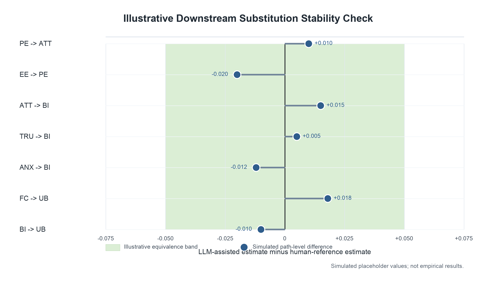

Can a Prespecified Large Language Model Workflow Augment MASEM-Ready Data Extraction?

Hosung You

College of Education, The Pennsylvania State University

Author Note

This summarized manuscript draft is prepared for development toward Research Synthesis Methods. Numerical results are placeholders pending completion of the validation study. The planned figure uses simulated values to illustrate the inferential-stability analysis and should not be interpreted as empirical evidence.

Abstract

Meta-analytic structural equation modeling (MASEM) requires extraction decisions that are more complex than ordinary effect-size coding because researchers must harmonize constructs, recover correlation matrices, attach study-specific sample sizes, and preserve moderator information. This study evaluates whether a prespecified large language model (LLM) workflow can augment human extraction of MASEM-ready evidence from studies of artificial intelligence adoption in higher education. The design compares structured LLM outputs against an adjudicated human reference standard and evaluates performance at three levels: element-level extraction, matrix-level validity, and downstream inferential stability. The primary contribution is not a vendor comparison. Instead, the study asks whether one transparent and reproducible LLM workflow can reduce routine extraction burden while preserving the substantive conclusions of a synthesis. Optional additional models may be used only as sensitivity checks or triage signals for cases requiring human review. The proposed reporting structure includes complete prompt documentation, model and access details, preprocessing records, human oversight procedures, code availability, and open validation data where legally permissible.

Keywords: evidence synthesis; large language models; data extraction; meta-analytic structural equation modeling; validation; research synthesis methods

Research Synthesis Relevance Statement

What is already known. LLMs are increasingly evaluated for screening and data extraction in systematic reviews and meta-analyses, but much of the existing evidence focuses on general study characteristics or conventional effect-size extraction. MASEM requires a more demanding evidentiary structure because the extracted data must form coherent construct mappings and correlation matrices.

What is new. This study evaluates LLM assistance specifically for MASEM-ready extraction. It moves beyond aggregate accuracy by assessing construct harmonization, correlation matrix recovery, systematic error patterns, and the stability of downstream structural conclusions.

Potential impact for Research Synthesis Methods readers. The study provides a compact validation template for deciding when LLM-assisted extraction is suitable for human-supervised research synthesis. It also clarifies why model comparison should be secondary to workflow validity, reproducibility, and inferential consequences.

Introduction

Data extraction is a central bottleneck in research synthesis. The problem is especially acute in MASEM because the analyst does not merely collect one effect size per study. The analyst must identify theoretically equivalent constructs across heterogeneous primary studies, extract bivariate relations among those constructs, preserve sample-size information for each relation, document measures and reliabilities, and code study features that may explain heterogeneity. These decisions are consequential because they shape the pooled correlation matrix from which structural paths and indirect effects are estimated.

LLMs may help with this work because they can process long documents, locate tables, summarize measurement information, and return structured outputs. Yet plausibility is not enough. A workflow that produces fluent study summaries may still fail at construct mapping, confuse latent and observed correlations, misread matrix diagonals, or omit study-specific sample sizes. For research synthesis, the appropriate question is therefore not whether an LLM can write about the literature, but whether it can assist with analysis-ready extraction under human supervision.

The present manuscript frames LLM assistance as augmentation rather than replacement. The primary workflow uses one prespecified LLM configuration and evaluates it against an adjudicated human reference standard. This choice makes the study less vulnerable to rapid model turnover and keeps the contribution focused on methodology. A model-comparison component can be useful if treated as a robustness or triage analysis, but it should not organize the article. Model rankings age quickly; transparent validation logic remains useful across model generations.

Current Study

This study evaluates an LLM-assisted extraction workflow using a validation subset from a larger synthesis of AI adoption in higher education. The parent synthesis is suitable for this purpose because it includes diverse technology acceptance constructs, AI-specific psychological variables, and primary studies that report correlation information in inconsistent formats. The validation study asks whether the LLM workflow can recover the information needed for MASEM and whether any extraction differences would alter the substantive interpretation of the resulting model.

The study is guided by three research questions. First, how accurately does the prespecified LLM workflow extract bibliographic, sample, construct, measurement, correlation, and moderator information relative to an adjudicated human reference standard? Second, which extraction tasks are most vulnerable to systematic error? Third, do LLM-assisted inputs preserve the pooled correlations and structural conclusions obtained from human-coded inputs?

Method

Corpus and sampling. The sampling frame consists of empirical studies eligible for the parent MASEM of AI adoption in higher education. The validation subset will be selected to represent variation in publication year, study design, region, AI tool type, construct coverage, and reporting format. The manuscript will report both the full parent corpus and the validation subset so readers can judge the scope of inference.

Human reference standard. Human coders will independently extract the target fields using a shared codebook. Discrepancies will be resolved through adjudication and documented in an audit trail. The resulting reference standard will be treated as the best available expert interpretation rather than an infallible ground truth.

Primary LLM workflow. The primary automated workflow will use the prespecified Codex 5.5 configuration selected for this project. The final manuscript will report the exact model identifier, interface, access dates, decoding settings, prompt version, document preprocessing steps, output schema, and human oversight procedure. The workflow will return structured outputs rather than prose summaries.

Extraction targets. The extraction schema covers bibliographic metadata, sample characteristics, construct names, operational definitions, scale sources, reliability coefficients, bivariate correlations, sample sizes attached to correlations, moderator variables, and notes on ambiguity. Correlation extraction will preserve the source table, construct order, matrix completeness, and any transformation needed before synthesis.

Analysis strategy. The study evaluates the workflow at three levels. Element-level validity assesses agreement for discrete fields and tolerance-based error for numeric fields. Matrix-level validity assesses whether the recovered correlation matrix is complete, symmetric where expected, and auditable. Inferential stability assesses whether substituting LLM-assisted inputs for human-coded inputs changes pooled correlations, focal structural paths, indirect effects, or substantive conclusions.

Optional robustness analysis. Additional LLMs may be retained as supplementary sensitivity checks, but they will not define the main contribution. Their role is to test whether conclusions are robust to model choice and whether cross-model disagreement can identify cases that require human review.

Table 1

Validation Design Summary

| Design component | Planned implementation | Reporting purpose |
|---|---|---|
| Parent corpus | AI adoption in higher education MASEM corpus | Defines source population for validation |
| Validation subset | Stratified subset representing reporting and construct diversity | Supports generalizability across extraction conditions |
| Human standard | Independent coding followed by adjudication | Provides reference for evaluating LLM outputs |
| Primary LLM | Prespecified Codex 5.5 workflow | Keeps article focused on workflow validity rather than vendor ranking |
| Extraction schema | Bibliographic, sample, construct, measurement, correlation, moderator fields | Aligns extraction with MASEM requirements |
| Optional robustness models | Supplementary sensitivity or triage only | Tests robustness without making model comparison the main claim |
| Open materials | Codebook, prompts, logs, data, and scripts | Supports reproducibility and auditability |

Table 2

Planned Analysis and Reporting Matrix

| Evaluation level | Unit of analysis | Primary metric | Interpretation |
|---|---|---|---|
| Bibliographic extraction | Study-field pair | Exact agreement | Routine information recovery |
| Sample extraction | Study-field pair | Exact or tolerance-based agreement | Accuracy of sample description and analytic N |
| Construct harmonization | Construct instance | Agreement with adjudicated construct family | Validity of theoretical mapping |
| Numeric extraction | Reported statistic | Absolute error and tolerance-band agreement | Precision of correlations, reliabilities, and sample sizes |
| Matrix recovery | Study matrix | Completeness, symmetry, numeric deviation | Readiness for MASEM import and audit |
| Moderator coding | Study-moderator pair | Agreement and discrepancy type | Reliability of heterogeneity analyses |
| Substitution analysis | MASEM input set | Change in pooled correlations and paths | Stability of substantive conclusions |
| Human workload | Study or extraction field | Time saved and adjudication rate | Practical value of augmentation |

Results Reporting Plan

The results section will begin with the composition of the validation subset and the distribution of extraction targets. Performance will be reported by extraction family instead of as a single overall score because the consequences of an error differ across fields. A bibliographic error is usually easy to detect, whereas a construct-mapping or correlation-matrix error can propagate into the synthesis.

The primary results table will report agreement, numeric error, and adjudication rates for each extraction family. The matrix-level results will report whether LLM-assisted matrices are complete enough to audit and whether deviations from the human reference standard remain within prespecified tolerance bands. The substitution analysis will then compare the human-coded and LLM-assisted MASEM inputs and outputs. The planned decision logic is that LLM assistance is defensible only if it reduces routine effort while preserving the sign, practical magnitude, and interpretation of focal parameters after human review.

Table 3

Primary Results Shell

| Extraction family | Number of fields | Agreement or error metric | Human adjudication rate | Decision |
|---|---:|---|---:|---|
| Bibliographic metadata |  |  |  |  |
| Sample characteristics |  |  |  |  |
| Construct harmonization |  |  |  |  |
| Measurement details |  |  |  |  |
| Reliability coefficients |  |  |  |  |
| Correlation coefficients |  |  |  |  |
| Matrix reconstruction |  |  |  |  |
| Moderator variables |  |  |  |  |

Figure 1

Illustrative simulation of downstream substitution analysis. The plotted values are simulated placeholders showing how the final manuscript will compare focal path estimates derived from human-coded inputs and LLM-assisted inputs. The equivalence band is illustrative and will be replaced by prespecified decision criteria before analysis.

Discussion

The study is designed to make a bounded methodological claim. A validated LLM workflow may be useful for accelerating first-pass extraction and focusing human attention on difficult cases, but it should not be presented as a replacement for expert synthesis judgment. The central issue is not whether an LLM can match humans on every field. The central issue is whether the workflow is transparent, auditable, and stable enough to support human-supervised MASEM preparation.

This framing also clarifies the role of model comparison. A main-text competition among three commercial systems would make the article vulnerable to model updates and implementation differences. By contrast, a prespecified primary workflow allows the manuscript to evaluate a reproducible research process. Supplementary model sensitivity can still be useful when it identifies extraction tasks where automated outputs diverge and human review should be prioritized.

The most important contribution will be the connection between extraction accuracy and downstream inference. MASEM conclusions depend on the structure and values of the pooled correlation matrix. If LLM-assisted extraction changes path signs, indirect-effect conclusions, or moderator interpretations, the workflow is not ready for substantive use even if element-level accuracy appears high. If conclusions remain stable after human review, the workflow can be recommended for bounded augmentation.

Limitations

The final study must report several limitations clearly. Commercial models may change after the validation run. Published studies may have been included in model training data, creating contamination risk that cannot be fully ruled out. Prompt sensitivity and document preprocessing choices may affect outputs. Finally, the human reference standard is an adjudicated expert product, not a perfect measurement of truth. These limitations do not invalidate the design, but they define the conditions under which the findings should be interpreted.

Conclusion

Paper B should be positioned as a validation study of LLM-assisted MASEM extraction, not as a model-benchmarking study. The summarized manuscript uses one primary LLM workflow, an adjudicated human reference standard, systematic error analysis, and downstream substitution analysis to evaluate whether LLM assistance can be responsibly integrated into research synthesis. This narrower framing is more durable, more aligned with methods-journal expectations, and more directly useful to researchers conducting complex quantitative syntheses.

Data Availability Statement

The final manuscript will archive the extraction schema, codebook, prompts, validation data, adjudication logs where permissible, and analysis scripts in an open repository.

Code Availability Statement

All scripts used to compute agreement metrics, matrix diagnostics, and substitution analyses will be archived with versioned dependencies and execution instructions.

Generative AI Disclosure

The manuscript evaluates a GenAI workflow as the object of research. The final submission will report the model name and version, access dates, interface, prompt text, preprocessing steps, output schema, model settings, and human oversight procedures. Any separate use of GenAI for manuscript preparation will be disclosed according to journal policy.

References

Cheung, M. W.-L. (2015). Meta-analysis: A structural equation modeling approach. Wiley.

Farotimi, O., Dunn, A., Van Lissa, C. J., Polanin, J. R., Mavridis, D., & Pigott, T. D. (2026). Guidance for manuscript submissions testing the use of generative AI for systematic review and meta-analysis. Research Synthesis Methods, 17, 237-239. https://doi.org/10.1017/rsm.2025.10058

Gartlehner, G., Kahwati, L., Hilscher, R., Thomas, I., Kugley, S., Crotty, K., Nussbaumer-Streit, B., Booth, G., Erskine, N., Konet, A., Hogan, S., Chew, R., & Viswanathan, M. (2024). Data extraction for evidence synthesis using a large language model: A proof-of-concept study. Research Synthesis Methods, 15, 576-589.

Jak, S., & Cheung, M. W.-L. (2020). Meta-analytic structural equation modeling with moderating effects on SEM parameters. Psychological Methods, 25(4), 430-449.

Konet, A., Thomas, I., Gartlehner, G., Hilscher, R., Kugley, S., Crotty, K., Nussbaumer-Streit, B., Booth, G., Erskine, N., Hogan, S., Chew, R., & Viswanathan, M. (2024). Performance of two large language models for data extraction in evidence synthesis. Research Synthesis Methods, 15, 818-824.
